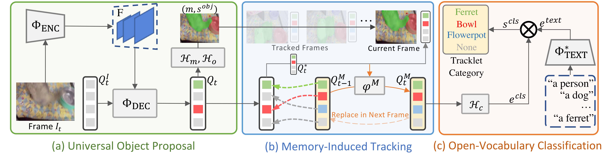

# OV2Seg

OV2Seg is the first end-to-end Open-Vocabulary video instance segmentation model, that can segment, track, and classify objects from novel categories with a Memory-Induced Transformer architecture.



## Setup

### Installation

- Linux or macOS with Python ≥ 3.6
- PyTorch ≥ 1.9 and [torchvision](https://github.com/pytorch/vision/) that matches the PyTorch installation.
  Install them together at [pytorch.org](https://pytorch.org) to make sure of this. Note, please check
  PyTorch version matches that is required by Detectron2.
- Detectron2: follow [Detectron2 installation instructions](https://detectron2.readthedocs.io/tutorials/install.html).
- `pip install -r requirements.txt`

This is an example of how to setup a conda environment.

```shell
conda create --name ov2seg python=3.8 -y
conda activate ov2seg
conda install pytorch==1.9.0 torchvision==0.10.0 cudatoolkit=11.1 -c pytorch -c nvidia
pip install -U opencv-python

# under your working directory
git clone git@github.com:facebookresearch/detectron2.git
cd detectron2
pip install -e .
cd ..

# install LVIS API
pip install git+https://github.com/cocodataset/panopticapi.git
pip install git+https://github.com/lvis-dataset/lvis-api.git

# clone this repo
git clone git@github.com:haochenheheda/LVVIS.git
cd LVVIS
pip install -r requirements.txt
cd ov2seg/modeling/pixel_decoder/ops
sh make.sh
cd ../../../..
```

### Data Preparation

**Structure for dataset**

```
datasets
|-- LVVIS
|-- coco
|-- lvis
|-- metadata
```

the metadata contains pre-computed classifiers for each dataset, which are generated by [DetPro](https://github.com/dyabel/detpro). If you want to generate customer classifiers, please follow this project.

**LVIS instance segmentation**

Please download COCO and LVIS dataset following [the instructions on detectron2](https://github.com/facebookresearch/detectron2/tree/main/datasets).

**LV-VIS**

Download the LV-VIS validation [videos](https://drive.google.com/file/d/1vTYUz_XLOBnYb9e7upJsZM-nQz2S6wDn/view?usp=drive_link) and [annotations](https://drive.google.com/file/d/1hvZHShzVNmxIQrGGB1chZTV2nqGShi6X/view?usp=drive_link), and organize the files according to the following structure.

```
datasets/LVVIS/
`-- val
    |-- JPEGImages
    |-- val_instances.json
    |-- image_val_instances.json # for image oracle evaluation
```

### Pretrained Model Preparation

Our paper uses ImageNet-21K pretrained models that are not part of Detectron2 (ResNet-50-21K from [MIIL](https://github.com/Alibaba-MIIL/ImageNet21K) and SwinB-21K from [Swin-Transformer](https://github.com/microsoft/Swin-Transformer)). Before training, 
please download the models and place them under `models/`, and following [this tool](./tools/convert-thirdparty-pretrained-model-to-d2.py) to convert the format.


```
models
`-- resnet50_miil_21k.pkl
```

## Train
We provide a script `scripts/train.sh`, that is made to train the OV2Seg model on LVIS dataset.

```shell
sh scripts/train.sh
```

## Test

To evaluate a model's performance, use

```shell
sh scripts/eval_video.sh  # evaluate on LV-VIS val set (video)
sh scripts/eval_image.sh  # evaluate on LV-VIS val set (image oracle)
```

You are expected to get results like this:

  |         | Backbone | LVVIS val |  LVVIS test | Youtube-VIS2019 | Youtube-VIS2021 | OVIS | weights|
  |:-------:|:--------:|:---------:|:-----------:|:---------------:|:---------------:|:----:|:------:|
  |  OV2Seg | ResNet50 |  14.2     | 11.4        | 27.2            | 23.6            | 11.2 | [link](https://drive.google.com/file/d/1YqL0PDmEhLayqaxTab9ag_ZX26ZS-zB4/view?usp=drive_link)|
  |  OV2Seg | Swin-B   |  21.1     | 16.4        | 37.6            | 33.9            | 17.5 | |

## Acknowledgement

This repo is based on [Mask2Former](https://github.com/facebookresearch/Mask2Former), [detectron2](https://github.com/facebookresearch/detectron2), and [Detic](https://github.com/facebookresearch/Detic/tree/main). Thanks for their great work!
