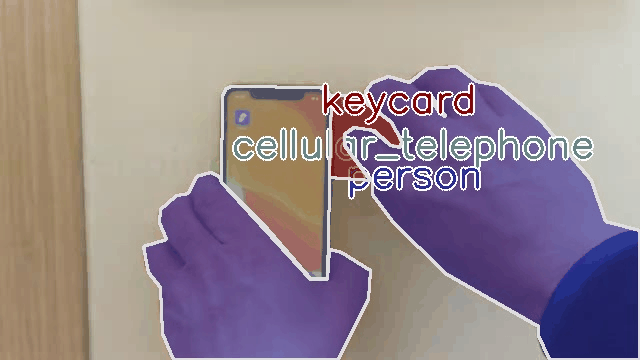
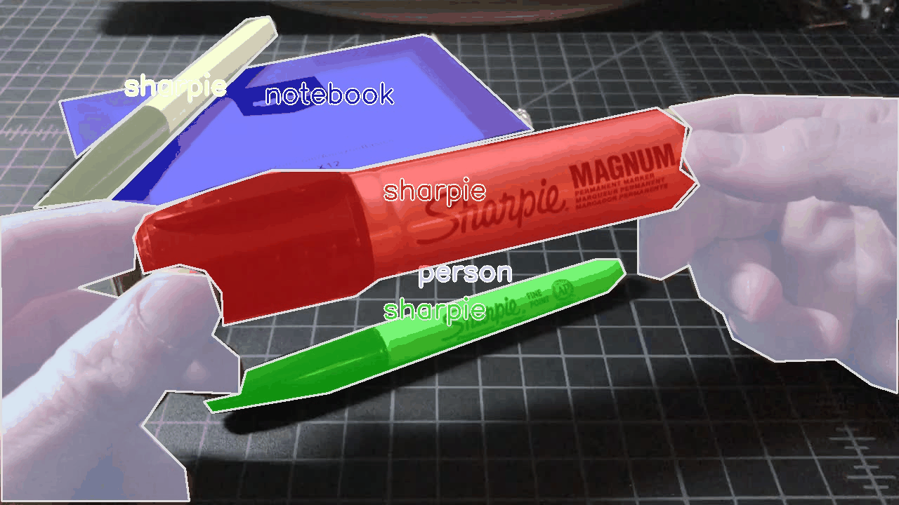
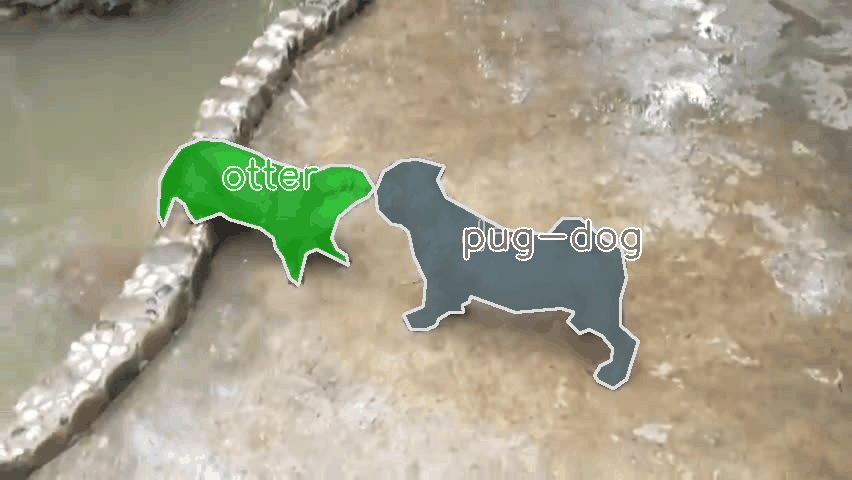
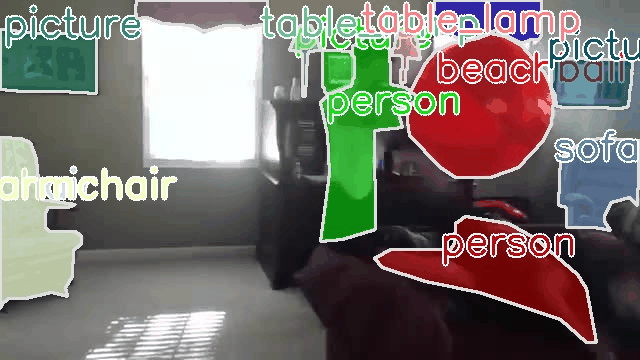
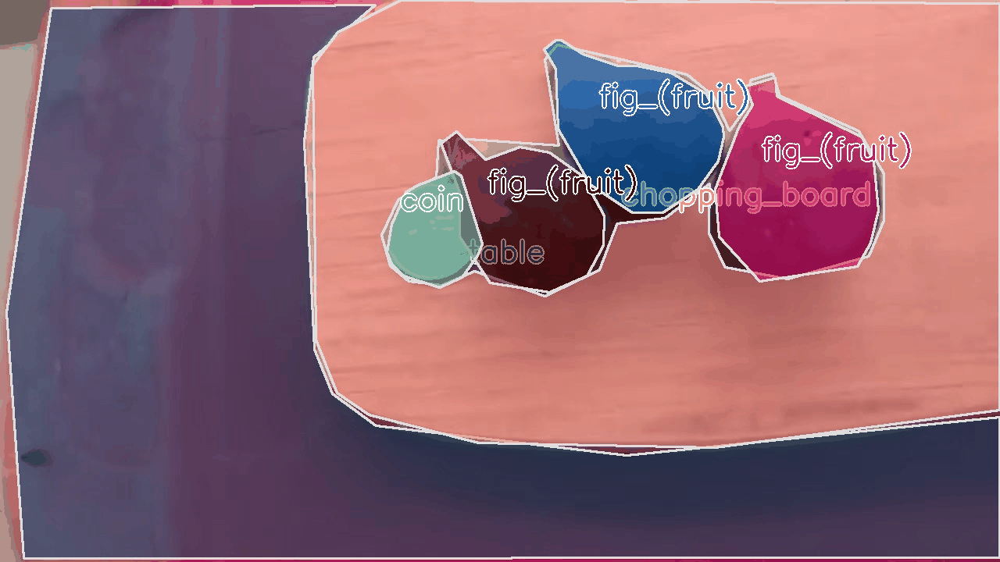
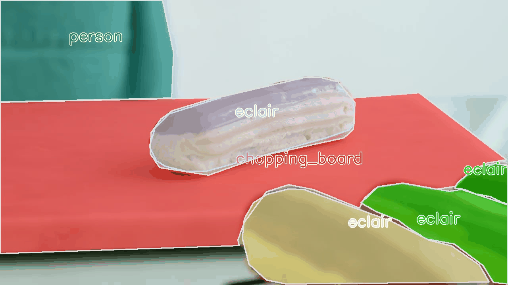
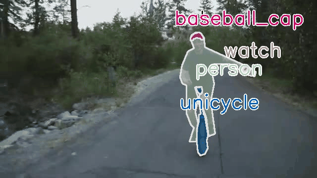

# LV-VIS: Large-Vocabulary Video Instance Segmentation dataset

This repo is the official implementation of `Towards Open Vocabulary Video Instance Segmengtation (ICCV2023 oral)`


## [Towards Open Vocabulary Video Instance Segmengtation](https://arxiv.org/pdf/2304.01715.pdf)

>[Haochen Wang](https://scholar.google.com/citations?user=WTZX3y8AAAAJ&hl)<sup>1</sup>\, Cilin Yan<sup>2</sup>\, Shuai Wang <sup>1</sup>\, Xiaolong Jiang <sup>3</sup>\, Xiaolong Jiang <sup>3</sup>\, Xu Tang<sup>3</sup>\, Yao Hu<sup>3</sup>, Weidi Xie <sup>4</sup>,Efstratios Gavves <sup>1</sup>

><sup>1</sup>University of Amsterdam, <sup>2</sup>Beihang University, <sup>3</sup>Xiaohongshu Inc, <sup>4</sup> Shanghai Jiao Tong University.

## LV-VIS dataset

LV-VIS is a dataset/benchmark for Open-Vocabulary Video Instance Segmentation. It contains a total of 4,828 videos with pixel-level segmentation masks for 26,099 objects from 1,196 unique categories.

 














<!--
 
-->

### Dataset Download

- [Training Videos](https://drive.google.com/file/d/1er2lBQLF75TI5O4wzGyur0YYoohMK6C3/view?usp=sharing)
- [Validation Videos](https://drive.google.com/file/d/1vTYUz_XLOBnYb9e7upJsZM-nQz2S6wDn/view?usp=drive_link)
- [Test Videos](https://drive.google.com/file/d/13Hgz2hxOPbe4_yTiUpwWb2ZWphaP06AF/view?usp=drive_link)
- [Training Annotations](https://drive.google.com/file/d/18ifd40HuXbjKBtwpUzmboucmOSuAzD1n/view?usp=sharing)
- [Validation Annotations](https://drive.google.com/file/d/1hvZHShzVNmxIQrGGB1chZTV2nqGShi6X/view?usp=drive_link)

### Dataset Structure

```
## JPEGImages

|- train
  |- 00000
    |- 00000.jpg
    |- 00001.jpg
       ...
  |- 00001
    |- 00000.jpg
    |- 00001.jpg
       ...
    ...
|- val
    ...
|- test
    ...

## Annotations
train_instances.json
val_instances.json
```
The annotation files have the same formation as [Youtube-VIS 2019](https://youtube-vos.org/challenge/2019).


## [Annotation Tool](https://github.com/haochenheheda/segment-anything-annotator)
We used this platform for the annotation of LV-VIS.
This platform is a smart video segmentation annotation tool based on [Lableme](https://github.com/wkentaro/labelme), [SAM](https://github.com/facebookresearch/segment-anything), and [STCN](https://github.com/haochenheheda/STCN).


## TODO

* Training/Inference code of OV2Seg
* Leaderboard for Val/test set

**NOTE:** 
* We haven't decided to release the annotation file for the test set yet. Please be patient.
* The training set is not exhaustively annotated.
* If you find mistakes in the annotations, please contact us (h.wang3@uva.nl). We will update the annotations.
  
## Cite

```
@inproceedings{wang2023towards,
  title={Towards Open-Vocabulary Video Instance Segmentation},
  author={Wang, Haochen and Wang, Shuai and Yan, Cilin and Jiang, Xiaolong and Tang, XU and Hu, Yao and Xie, Weidi and Gavves, Efstratios},
  booktitle={Proceedings of the IEEE/CVF International Conference on Computer Vision},
  year={2023}
}
```
